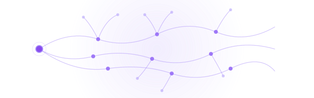

<div align="center">

🌐 [English](#) · [Español](docs/README.es.md) · [Português BR](docs/README.pt-BR.md)


# 🌿 HONGUERA

### **Open Hardware for Precision Fungal Cultivation**

*A mycelium of sensors. A network that thinks. A body that grows.*



[](LICENSE)
[](firmware/LICENSE)
[](docs/LICENSE)
[](firmware/)
[](software/docker-compose.yml)
[](https://certification.oshwa.org/)
[](https://github.com/Freeak88/honguera)

[_specs_](SPEC.md) · [ _build guide_ ](docs/build-guide/) · [ _species_ ](docs/species/profiles.md) · [ _BOM_ ](hardware/BOM/BOM_v0.1.md) · [ _contribute_ ](CONTRIBUTING.md)

</div>

---

> **Honguera** is a precision climate control system for indoor fungal cultivation.
> It manages temperature, humidity, and CO₂ using an ESP32, standard sensors, and a distributed intelligence network.
>
> **It's not a thermostat. It's a digital mycelium.**

A real mycelium has no central brain. Each hypha senses, decides, and responds locally — yet shares information with the entire network. Honguera works the same way: distributed sensors, local control at the node, and an ML layer that learns the thermal inertia of the space — just as mycelium learns the geometry of its substrate.

**Designed to replicate. Like a spore.**

---

## ⚡ Quick Start

```bash
# Clone the mycelium
git clone https://github.com/Freeak88/honguera.git
cd honguera

# Spin up the network (MQTT + InfluxDB + Node-RED + Grafana)
cd software && docker compose up -d

# Flash the node (PlatformIO)
cd firmware && pio run --target upload

# Monitor telemetry
pio device monitor
```

<details>
<summary>🔧 Prerequisites</summary>

- ESP32 DevKit (any variant)
- Sensors: SHT40 + MH-Z19B (+ optional DS18B20)
- PlatformIO installed
- Docker + Docker Compose
- Local WiFi network

Total prototype cost: **~$110-170 USD** → [Full BOM](hardware/BOM/BOM_v0.1.md)
</details>

---

## 🧬 Architecture — The Body of the Mycelium

```
                         ┌─────────────┐
                         │   Mycelium   │
                         │  (ML Layer)  │
                         │  Predictive  │
                         └──────┬───────┘
                                │ learns thermal inertia
                                ▼
┌──────────┐    MQTT     ┌──────────┐    writes    ┌──────────┐
│ Hyphae×N │◄───────────►│  Mantle  │─────────────►│  Soil    │
│ (ESP32)  │   pub/sub   │(Mosquitto)│              │(InfluxDB)│
└────┬─────┘             └──────────┘              └──────────┘
     │                                                     │
     │ senses         ┌──────────┐                         │
     ├────────────────►│  Frond   │◄────────────────────────┘
     │                 │(Grafana) │        reads
     │                 └──────────┘
     │
     │ actuates
     ▼
┌──────────┐  ┌───────────┐  ┌──────────┐
│  Heater   │  │ Humidifier │  │ Exhaust  │
│ SSR 700W  │  │ Ultrasonic │  │  CO₂     │
└──────────┘  └───────────┘  └──────────┘
```

| Organ | Component | Biological function |
|-------|-----------|---------------------|
| **Hyphae** | ESP32 + sensors | Sense the environment, decide locally |
| **Mantle** | Mosquitto (MQTT) | Signaling network between hyphae |
| **Soil** | InfluxDB | Memory. Stores what was learned |
| **Frond** | Grafana / Node-RED | Visualization. The visible surface |
| **Mycelium** | ML Layer | Distributed intelligence. Predicts, adapts |

---

## 🍄 Supported Species

Each species is a distinct "biological firmware." Loaded as a JSON profile via MQTT:

| Species | Fruit. temp | Humidity | Max CO₂ | Difficulty |
|---------|------------:|---------:|--------:|:----------:|
| 🟤 **Oyster** _(P. ostreatus)_ | 18°C | 90% | 800ppm | ⭐ |
| 🟡 **Shiitake** _(L. edodes)_ | 18°C | 85% | 1000ppm | ⭐⭐ |
| 🟠 **Lion's Mane** _(H. erinaceus)_ | 18°C | 90% | 600ppm | ⭐⭐ |
| 🔴 **Reishi** _(G. lucidum)_ | 25°C | 90% | 800ppm | ⭐⭐⭐ |

→ [Full profiles with all 3 growth phases](docs/species/profiles.md)

---

## 📐 Hardware

### Chamber Specifications

| Parameter | Value |
|-----------|-------|
| Dimensions | 2m × 1.5m × 2m |
| Structure | Cured wood + aluminum/fiberglass insulation |
| Capacity | ~150kg substrate |
| Heating | Radiant floor cable 700W + SSR |
| Humidification | 3× piezoelectric transducers 1.66MHz |
| Gas management | CO₂-controlled exhaust fan |

→ [SPEC.md](SPEC.md) · [Blueprints PDF](blueprints/) · [BOM](hardware/BOM/BOM_v0.1.md)

### Schematic (in progress)

The KiCad PCB design is on its way. Meanwhile, the prototype runs on breadboard.

[](hardware/kicad/)
[](https://jlcpcb.com/)

---

## 💻 Firmware

```
firmware/
├── src/
│   └── main.cpp       ← Control loop + sensors + MQTT
├── lib/               ← Custom libraries
└── platformio.ini     ← Dependencies and config
```

### Features v0.1

- ✅ SHT40 (T/H), MH-Z19B (CO₂), DS18B20 (water) reading
- ✅ Hysteresis control: heater, humidifier, exhaust
- ✅ MQTT pub/sub: JSON telemetry every 15s
- ✅ Remote phase control (incubation → induction → fruiting)
- ✅ Manual override via MQTT
- ✅ Last Will + online/offline status

### Up Next

- [ ] OTA updates
- [ ] Auto PID tuning
- [ ] Power-saving mode (solar-ready)
- [ ] WiFi Manager (AP captive portal)
- [ ] Multi-node (multiple chambers, one broker)

[](firmware/)
[](firmware/)

---

## 🧠 Software Stack

```bash
docker compose up -d    # One command to spin up the entire ecosystem
```

| Service | Port | Role |
|---------|------|------|
| Mosquitto | 1883 | MQTT broker — the nervous system |
| InfluxDB | 8086 | Time series — the mycelium's memory |
| Node-RED | 1880 | Orchestration + automation |
| Grafana | 3000 | Real-time dashboards |

[](software/docker-compose.yml)
[](software/)
[](software/)
[](software/)

---

## 🔬 Predictive ML (Roadmap)

The mycelium doesn't react. **It anticipates.**

| Phase | Model | Target |
|-------|-------|--------|
| v0.1 | Simple hysteresis | Functional ✅ |
| v0.2 | Linear regression | Learn thermal inertia |
| v0.3 | LSTM | 15-min prediction, ±0.3°C |
| v0.4 | Federated (multi-node) | Learn from other mycelia |

---

## 🗺️ Roadmap

```
┌──────────────┐    ┌──────────────┐    ┌──────────────┐    ┌──────────────┐
│  v0.1 SPORE  │───►│  v0.2 HYPHAE │───►│  v0.3 MYCELIUM│───►│  v1.0 FRUIT  │
│  Prototype   │    │  PCB + WiFi  │    │  ML + Multi  │    │  Public      │
│  quincho BA  │    │  Manager     │    │  node        │    │  release     │
└──────────────┘    └──────────────┘    └──────────────┘    └──────────────┘
     ✅ NOW             Q3 2026             Q4 2026             2027
```

---

## 🤝 Community

The mycelium grows through connection. It doesn't work in isolation.

| Channel | Link |
|---------|------|
| 💬 Discord | _coming soon_ |
| 📰 Hackaday.io | _coming soon_ |
| 📘 Instructables | _coming soon_ |
| 🐛 Issues | [GitHub Issues](../../issues) |
| 📖 Wiki | _coming soon_ |

### Contributing

Every contribution is a new hypha joining the network.

1. Fork → Branch → PR
2. One idea = one PR. Simple.
3. Conventions in [CONTRIBUTING.md](CONTRIBUTING.md)

[](CONTRIBUTING.md)
[](../../issues?q=is%3Aissue+is%3Aopen+label%3A%22good+first+issue%22)

---

## 📜 Licenses

A multi-core project. Each layer breathes under its own license:

| Layer | License | Why |
|-------|---------|-----|
| 🔩 Hardware (PCB, mechanical) | **CERN-OHL-S 2.0** | Derivatives must stay open |
| ⚡ Firmware | **GPLv3** | Strong copyleft. Protects the network |
| 📄 Documentation | **CC BY-SA 4.0** | Attribution + share-alike |

## 🤖 AI Usage Disclosure

This project uses generative AI tools as development aids:

| Use | Model | Scope |
|-----|-------|-------|
| Firmware & docs drafting | Claude Sonnet 4, GLM-5 | Translation (ES→EN), boilerplate, formatting |
| ML model experimentation | Various | Hyperparameter search, code templates |

All AI-generated content is reviewed, tested, and verified by the human author before merging. Technical decisions, architecture, and domain knowledge (mycology, IoT, thermal engineering) are human-authored.

Generated code in commits is marked in the commit message with the model used.

---

<div align="center">

**Made with 🍄 by the open hardware community**

*Where the sensor network behaves like a hyphal network.*

</div>
